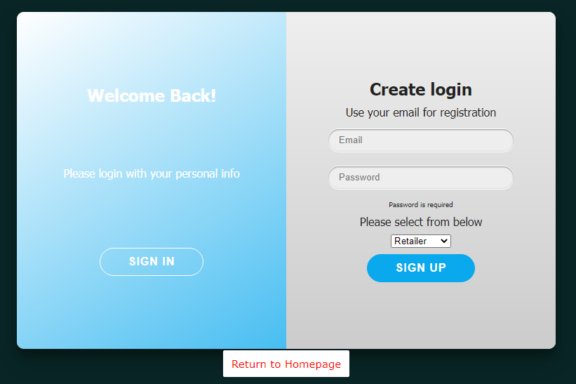

# Log in page for freeingreturns.com

**Technology used in this project**
1. Node JS.
2. HTML and CSS
3. Bootstrap CSS
4. Vue js.
5. Email JS.
6. Firebase for database.
7. PWA



## About

https://login.freeingreturns.com/

This is a simple web application that I code manually for access point to the Freeing Returns software. The main logic of the application is the signup section. Users will enter their information into the form and the form will then submit the users info. to the firebase database. If users was to not complete the sign up section and leave the page, the form will still automatically submit the data to the database. Once users submit the form, an email will be sent from a server to that user with a confirmation code. User can use the confirmation code to sign in to use the Freeing Returns software. 

## Project setup

Please install [node JS](www.nodejs.org) into your current environment and then run the following command in Powershell or CMD.
```
npm install
```

### Compiles and hot-reloads for development
```
npm run serve
```

### Compiles and minifies for production
```
npm run build
```
